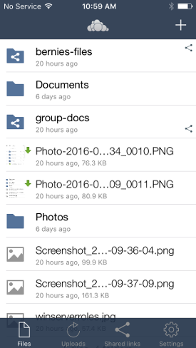

==========================
Using the ownCloud iOS App
==========================

Accessing your files on your ownCloud server via the Web interface is easy and 
convenient, as you can use any Web browser on any operating system without 
installing special client software. However, the ownCloud iOS app offers 
some advantages over the Web interface:

* A simplified interface that fits nicely on an iPhone or iPad
* Automatic synchronization of your files
* Share files with other ownCloud users
* Easily upload files from your device to ownCloud
* Optional PIN for stronger security

Getting the ownCloud iOS App
--------------------------------

Open Safari, or any Web browser, and point it to your ownCloud server. Log in 
and look on your Personal page for a link to the ownCloud app on iTunes. When 
you install the ownCloud app and open it you'll be prompted for your ownCloud 
server URL and login. When it connects it opens to your Files page.

You'll also find links and information at the ownCloud `installation page 
<https://owncloud.org/install/>`_.

Managing Your Files
-------------------

All your files on your ownCloud server are listed on the Files page, but are not 
downloaded to your iPhone or iPad until you tap on them. Downloaded files are 
marked with a little green arrow. Thumbnails are displayed for both downloaded 
and not-downloaded files (owncloud 8.0+ only). Click the overflow button at the 
top right (the three-dot button) to upload files to your server, create a new 
folder, or sort your files alphabetically or by date.

The Files button at the bottom takes you back to your main Files page. The 
Uploads button shows your history of uploads to your ownCloud server. The Shared 
Links button shows how many files you have shared by link.

When you're in the Files view, slide any filename to the right to expose your 
file management options: Trash, Share, and the More button has 
options for Open With, Rename, Move, or mark as Favorite.

.. image:: images/ios-slider.png
   :alt: Slide filename right to expose management options.
   
The More button has different options for folders: Rename, Move, Download 
Folder, and Favorite.   

When you tap any file in the Files view it downloads to your iPhone or iPad, if 
it hasn't already been downloaded, and opens a preview. 

The little arrow button on the bottom left has options for sharing the file via 
email and instant messaging, saving or copying, and printing. The star button 
marks it as a Favorite. The triangular Share button opens a share dialog. The 
trashcan allows you to delete the file from your device, your ownCloud server, 
or both.

Sharing Files
-------------

You can share with other ownCloud users, and create public share links. If your 
ownCloud server administrator has enabled username auto-completion, when you 
start typing user or group names they will auto-complete. After you have shared 
files, click the Share button to see who you have shared with, and to remove 
shares.

You may also create Federation shares from your iOS app. If you are sharing 
files with ownCloud 9.x users, you can enter their username (auto-completion is 
supported for Federation sharing) and server URL in the User and Groups dialog 
to create a Federation share; for example freda@example.com/owncloud. (The exact 
Federation share link is on every ownCloud user's Personal page in the ownCloud 
Web interface.) Please note that this is not yet fully-implemented in the iOS 
app: your recipient needs to use their ownCloud Web interface to receive the 
notification asking if they wish to accept the share, and then they must click 
an "Accept" button.

.. image:: images/ios-sharing.png
   :alt: File sharing dialog.
   
You may share files with people who are not using ownCloud, and with 
older ownCloud servers by creating a share link. Tap "Get Share Link", and this 
opens a menu with options to automatically create an email notification, or to 
copy the link so that you can paste it wherever you like. You have options to 
put an expiration date on the share, and to password-protect it.

When you create a share link on a folder, you also have the option to make it 
editable.

.. image:: images/ios-share-link.png
   :alt: Share link on a folder.   

Settings
--------

The Settings button (bottom right of any screen) takes you to the Settings 
screen. You can add and edit new accounts, set a login PIN (personal 
identification number), and it has links to Help, Recommend to a Friend, Send 
Feedback, and your app version number. Click the information button at the 
right of your ownCloud accounts to change your password. Slide the account name 
to the left to expose the Delete button.

.. image:: images/ios-settings.png
   :alt: iOS app settings screen.
   