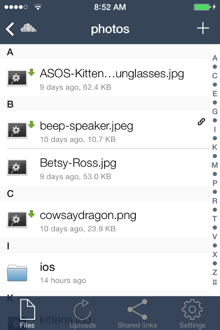

==========================
Using the ownCloud iOS App
==========================

Accessing your files on your ownCloud server via the Web interface is easy and 
convenient, as you can use any Web browser on any operating system without 
installing special client software. However, the ownCloud iOS app offers 
some advantages over the Web interface:

* A simplified interface that fits nicely on an iPhone or iPad
* Automatic synchronization of your files
* Easily upload files from your device to ownCloud
* Optional PIN for stronger security

Getting the ownCloud Android App
--------------------------------

Open Safari, or any Web browser, and point it to your ownCloud server. You 
don't even have to log in because you’ll see a screen with a download link to 
the ownCloud app in the `iTunes App store
<https://itunes.apple.com/us/app/owncloud/id543672169>`_.

.. image:: images/ios-app.png

Install the ownCloud app and open it. You'll be prompted for your ownCloud 
server URL and login. When it connects it opens to your Files page.

.. image:: images/ios-files.png

Managing Your Files
-------------------
All your files on your ownCloud server are listed on the Files page, but are not 
downloaded to your iPhone or iPad until you tap on them. Downloaded files are 
marked with a little green arrow. Click the cross button at the top right to 
upload files to your ownCloud server, or to create a new folder. 

The Files button at the bottom takes you back to your main Files page. The 
Uploads button shows your history of uploads to your ownCloud server. The Shared 
Links button shows how many files you have shared by link.

When you're in the Files view, slide any filename to the right to expose your 
file management options: Trash, create a Share link, and the More button has 
options for Open With, Rename, Move, or mark as Favorite.

.. image:: images/ios-slider.png

When you tap any file in the Files view it downloads to your iPhone or iPad, if 
it hasn't already been downloaded, and opens a preview. 

.. image:: images/ios-betsyross.png

The little arrow button on the bottom left has options for sharing the file via 
email and instant messaging, saving or copying, and printing. The star button 
marks it with a star in the Files view. The triangular Share button creates a 
share link. The trashcan allows you to delete the file from your device, your 
ownCloud server, or both.

Settings
--------
The Settings button (bottom right of any screen) takes you to the Settings 
screen. The Manage Accounts section is where you add and remove your ownCloud 
account settings, and change your passwords.

The App Pin is for setting a personal identification number on your ownCloud 
app. When you set a PIN you must enter it to access your ownCloud app. This is 
good security and highly recommended that you do this.

The Settings screen also has links to Help, Recommend to a Friend, Send 
Feedback, and your app version number.

.. image:: images/ios-settings.png

