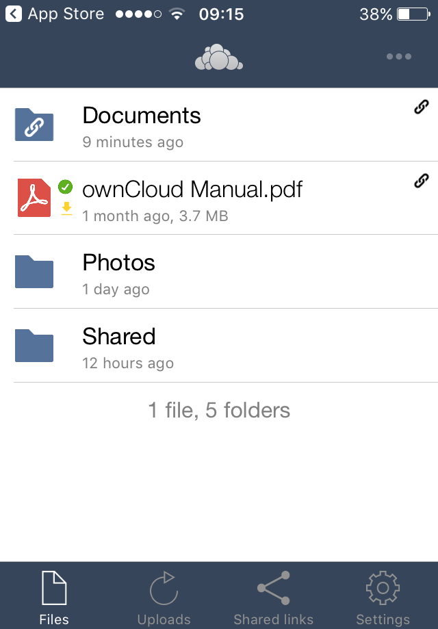
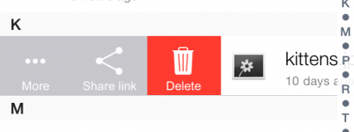
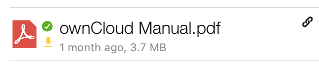
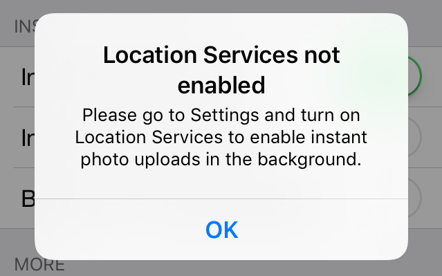
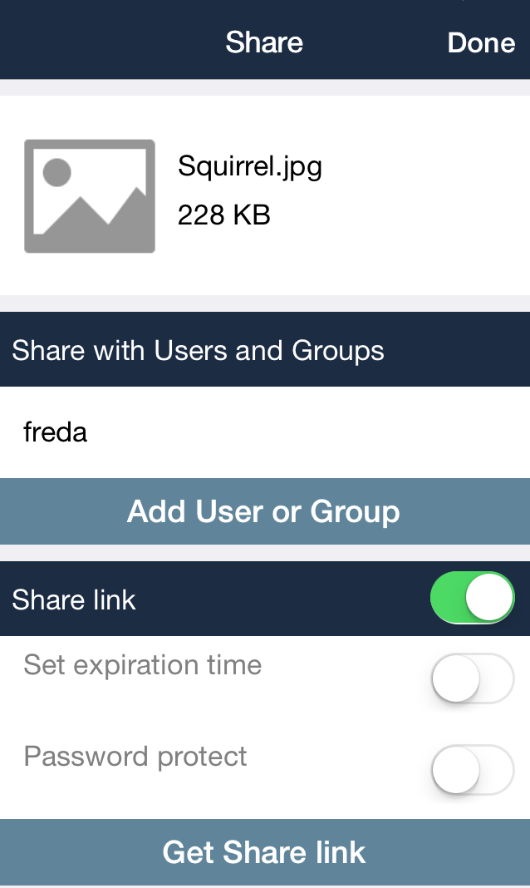
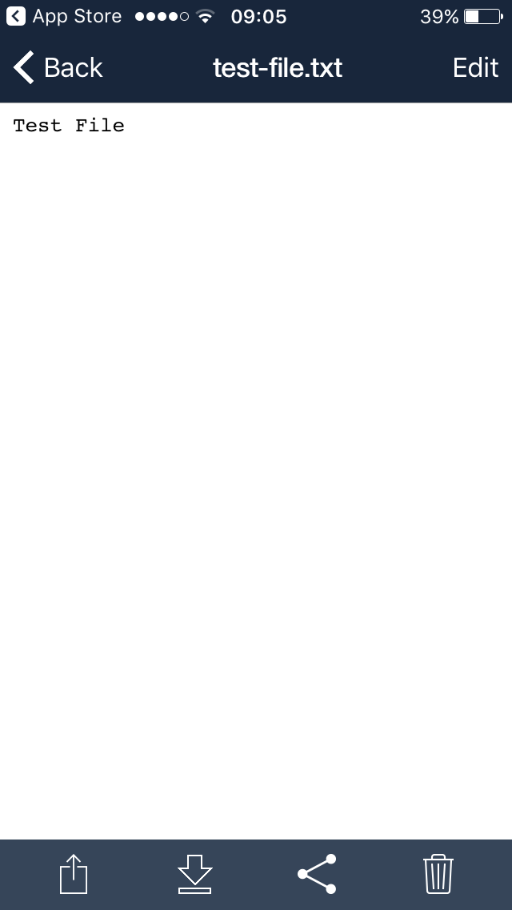
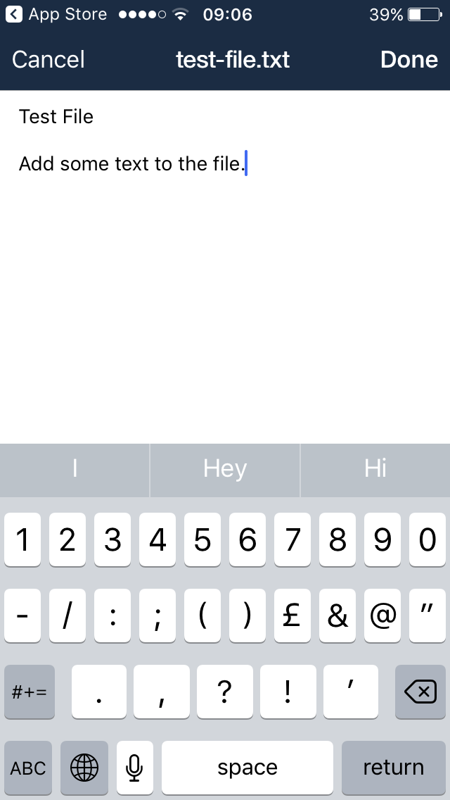
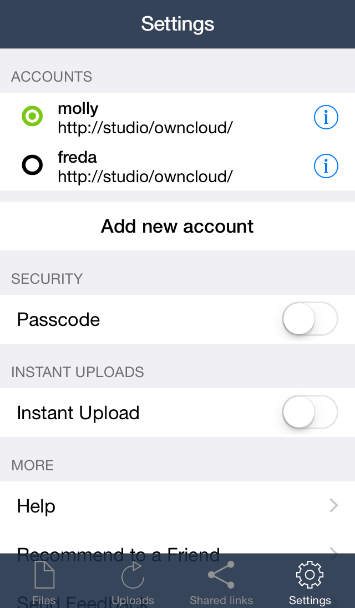

==========================
Using the ownCloud iOS App 3.6.2
==========================

Accessing your files on your ownCloud server via the Web interface is easy and 
convenient, as you can use any Web browser on any operating system without 
installing special client software. However, the ownCloud iOS app offers 
some advantages over the Web interface:

* A simplified interface that fits nicely on an iPhone or iPad
* Automatic synchronization of your files
* Share files with other ownCloud users
* Easily upload files from your device to ownCloud
* Optional PIN for stronger security

Getting the ownCloud iOS App 
--------------------------------

Open Safari, or any Web browser, and point it to your ownCloud server. Log in 
and look on your Personal page for a link to the ownCloud app on iTunes. When 
you install the ownCloud app and open it you'll be prompted for your ownCloud 
server URL and login. When it connects it opens to your Files page.

You'll also find links and information at the ownCloud `installation page 
<https://owncloud.org/install/>`_.

Managing Your Files
-------------------

All your files on your ownCloud server are listed on the Files page, but are
not downloaded to your iPhone or iPad until you tap on them. 
Downloaded files are marked with a little green arrow. 
Thumbnails are displayed for both downloaded and not-downloaded files (owncloud
8.0+ only). 
Click the overflow button at the top right (the three-dot button) to upload
files to your server, create a new folder, or sort your files alphabetically or
by date.

The Files button at the bottom takes you back to your main Files page. 
The Uploads button shows your history of uploads to your ownCloud server. 
The Shared Links button shows how many files you have shared by link.

When you're in the Files view, slide any filename to the right to expose your 
file management options. 
These are: Trash, Share, and More. 
The More button has options for Open With, Rename, Move, Available Offline.

   
The More button has different options for folders. 
These are: Rename, Move, Download Folder, and Available Offline.   

Downloading Files
~~~~~~~~~~~~~~~~~

When you tap any file or folder in the Files view it downloads to your iPhone or iPad, if
it hasn't already been downloaded, and opens a preview. 
If the file has been successfully downloaded, then it will have a tick next to
its icon, as in the image above. 

Sharing Files
~~~~~~~~~~~~~

The little arrow button on the bottom left has options for sharing the file via
email, instant messaging (or any of your other apps), as well as saving and copying.

Making Files Available Offline
~~~~~~~~~~~~~~~~~~~~~~~~~~~~~~

.. image:: images/ios-file-buttons.png
   :alt: Making files available offline (or not)

The underlined down arrow button, which you can see in the image above, marks
it as available offline. 
If the icon is not filled white, then the file is not available offline.
If the file is filled white, then it is available offline. 
Click the button to make the file available, or not available offline.

If you set your file or folder as available offline that will keep it synchronized if changes are made in other clients.

Your files will always be downloaded and updated.

Sharing Files with users or by public link
~~~~~~~~~~~~~~~~~~~~~~~~~~~~~~~~~~~~~~~~~~

The triangular Share button opens a share dialog, allowing you to start
`Sharing Files`_.

You can share with other ownCloud users and edit the privileges for each user.

Multiple public links are supported; you can create each one with different options, e.g., password and expiration date. 

Deleting Files
~~~~~~~~~~~~~~

The trash can allows you to delete the file from your device, your ownCloud
server, or both.

Instant Upload of Photos and Videos
-----------------------------------

.. image:: images/ios-instant-uploads-all-disabled.png
   :alt: Instant Uploads

New in version 3.5.2 is the ability for instantly uploading to ownCloud any photos and videos which you create with your iPhone. 
In Settings, you’ll find a new section titled **Instant Uploads**. 
In that section you’ll see, initially disabled, two options. These are:

- Instant Upload Photos
- Instant Upload Videos

Toggle the one that you want, or both, if that’s your preference. 

When enabling "*Instant Upload Photos*", you will be prompted to allow access to your photos, as you can see in the screenshot below.
For this functionality to work, you have to click "OK".

.. image:: images/ios-instant-uploads-enabled-access-notification.png
   :alt: ownCloud needs access to your photos for Instant Upload Photos to work.

When enabling "*Instant Upload Videos*", you will need to have Location Services enabled.
Otherwise, you’ll see the notification in the screenshot below.
For this functionality to work, Location Services are required.

Once you have enabled one or both of the Instant Upload options, a new folder, called InstantUpload, will appear in your Files view. 
If you click on it, you will see all of the photos and videos which have been automatically uploaded from your iPhone to your ownCloud account, as in the image below.

.. image:: images/ios-instant-upload-file-list.png
   :alt: Photos and videos which were automatically uploaded to ownCloud by Instant Upload.

Sharing Files
-------------

You can share with other ownCloud users, and create public share links. If your 
ownCloud server administrator has enabled username auto-completion, when you 
start typing user or group names they will auto-complete. After you have shared 
files, click the Share button to see who you have shared with, and to remove 
shares.

You may also create Federation shares from your iOS app. If you are sharing 
files with ownCloud 9.x users, you can enter their username (auto-completion is 
supported for Federation sharing) and server URL in the User and Groups dialog 
to create a Federation share; for example freda@example.com/owncloud. (The exact 
Federation share link is on every ownCloud user's Personal page in the ownCloud 
Web interface.) Please note that this is not yet fully-implemented in the iOS 
app: your recipient needs to use their ownCloud Web interface to receive the 
notification asking if they wish to accept the share, and then they must click 
an "Accept" button.

   
You may share files with people who are not using ownCloud, and with 
older ownCloud servers by creating a share link. Tap "Get Share Link", and this 
opens a menu with options to automatically create an email notification, or to 
copy the link so that you can paste it wherever you like. You have options to 
put an expiration date on the share, and to password-protect it.

When you create a share link on a folder, you also have the option to make it 
editable.

.. image:: images/ios-share-link.png
   :alt: Share link on a folder.   

Editing Text Files
------------------

From version 3.5.0 onward you can edit text files directly within the
application.
To do so, first click on the text file which you want to edit. 
This will display the contents of the file, as in the example below. 

   
Then, click "Edit" in the top right-hand corner, which opens the file for
editing, as in the example below. 

Make all the changes which you need to, and when you're finished editing, click
"Done" in the top right-hand corner. 
This will save the changes and begin the sync process to your ownCloud account.

Settings
--------

The Settings button (bottom right of any screen) takes you to the Settings 
screen. 
Here, you can:

- Add and edit new accounts
- Set a Passcode Lock (personal identification number) & Touch Id
- Get help
- Recommend the app to a Friend
- Send Feedback
- Find the application version number

Click the three dot icon button at the 
right of your ownCloud accounts and a menu with next option will appear:
- Edit Password
- Clear cache (will delete all your downloaded files in your device)
- Remove account 

Slide the account name to the left to expose the Delete button. A quick access to remove the account.

   
